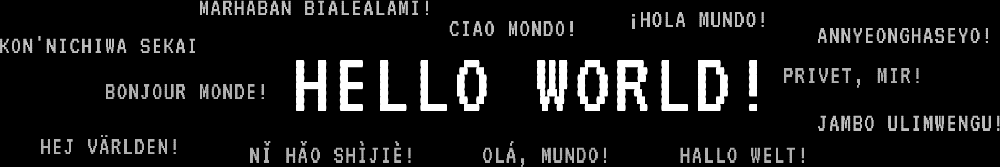

<!--
  ╭─────────────────────────────────────────────────────────────────────────╮
  │  ✨ FABULOUSLY GENERATED BY AREPODESIR ✨                               │
  │  💖 Made with love, sparkles & fabulous vibes 💖                       │
  ├─────────────────────────────────────────────────────────────────────────┤
  │  🏷️  Version Hash: 687efb863387                                       │
  │  📅 Generated: 2026-01-12T21:33:32.089Z                              │
  │  🔧 Generator: arepodesir                                            │
  │  📦 Version: 1.001                                                   │
  │  ⚡ MACH: 1.0001                                                      │
  ╰─────────────────────────────────────────────────────────────────────────╯
  
  This README was sexily crafted by the arepodesir generator.
  Serving README realness since 2024 💅
  For more info: https://github.com/arepodesir/arepodesir
-->

<h1 align="center">
  <a href="https://whoisarepo.space" label="fyi">WHOISAREPO❓</a>
</h1>

<blockquote align="center">
    
<i>Programmer (n.) - One who forges programmes.</i>

</blockquote>

<blockquote align="right">
<i>I am who I am 
& who I am is what I am 
& who I am is where I am 
& who I am is when I am 
& who I am is why I am. 
</i></blockquote>

---

### *[forge](https://whoisarepo.fyi) [a](https://desirfoundation.help) [better](https://whoisarepo.space) [phaneron.](https://logos.computer)*

<h2 align="center">🛠️ TECH STACK</h2>

             

<h2 align="center">📊 STATUS</h2>

| Status | Value |
| :--- | :--- |
| 🎭 **Mood** | 🚀 Building |
| ⚡ **Activity** | Deep Work Mode |
| 🔨 **Current Project** | `arepodesir` |

  

  

  

 

<h2 align="center">📈 GITHUB METRICS</h2>

  

  

  

  

  

  

<h1 align="center">LATEST ACTIVITIES</h1>

| NAME | KIND | TL;DR | LINK | MACH |
| :--- | :--- | :--- | :--- | :--- |
| arepodesir | README | This very README file & its Production Rules. | [@arepodesir](https://github.com/desirtechnologies/blackprint) | `1.001` |
| LOGOS | Operating System | A distributed web-operating system. | [@logos](https://github.com/logos-os/logos) | `1.0001` |
| LOVE-LANG | Programming Language | The List Oriented Virtualized Evaluator. | [@love-lang](https://github.com/love-metalang/love-lang) | `1.001` |
| KPAX | A Political Forum. | Kindred Peace Programme | [@kpax](https://github.com/desirfoundation/kpax) | `1.001` |
| drkaitwhitcomb | Portfolio Website | This very README file & its Production Rules. | [@drkaitwhitcomb](https://github.com/drkaitwhitcomb/drkaitwhitcomb) | `2.001` |
| gideon | Inference Platform | This very README file & its Production Rules. | [@gideon](https://github.com/desirablesolutions/gideon) | `1.001` |

<h2 align="center">🎓 EDUCATION</h2>

| Institution | Degree | Field | Years |
| :--- | :--- | :--- | :---: |
| Western Governors University | Cybsecurity & Information Assurance (B.S) | Information Technology | 2024-Present |
| The Bloom Institute of Technology | Full Stack Development | Software Engineering | 2018 - 2020 |

<table align="left">
<tr title="socials">
<h1 align="left">SOCIALS </h1>
    <th></th>
    <th></th>
    <th></th>
    <th></th>
    <th></th>
    <th></th>
</tr>
</table>

<table align="right">
<tr title="languages">
<h1 align="right">LANGUAGES </h1>
    <th></th>
    <th></th>
    <th></th>
    <th></th>
    <th></th>
    <th></th>
</tr>
</table>

<table align="left">
<tr title="skills">
<h1 align="left">SKILLS </h1>
    <th></th>
    <th></th>
    <th></th>
    <th></th>
    <th></th>
    <th></th>
</tr>
</table>

<table align="right">
<tr title="links">
<h1 align="right">LINKS </h1>
    <th></th>
    <th></th>
    <th></th>
    <th></th>
    <th></th>
    <th></th>
</tr>
</table>

<h2 align="center">📢 LATEST UPDATES</h2>

| Platform | Update |
| :------- | :----- |
| 🐦 **Twitter/X** | Working on LOGOS OS - a distributed virtual operating system [→](https://twitter.com/arepodesir) |
| 💼 **LinkedIn** | Open to collaboration on systems programming projects [→](https://linkedin.com/in/arepodesir) |
| 📝 **Blog** | New post: Building Type-Safe README Generators with Effect-TS [→](https://whoisarepo.space/blog) |

<h2 align="center">📰 READING LIST</h2>

- ⚡ [**The Future of Effect-TS**](https://effect.website/blog) — *Effect Blog*
- 🥟 [**Building Better CLIs with Bun**](https://bun.sh/blog) — *Bun Blog*
- 🦀 [**Rust for Systems Programming**](https://blog.rust-lang.org) — *Rust Blog*
- λ [**Functional Programming Patterns**](https://www.fpcomplete.com/blog) — *FP Complete*

<h2 align="center">📄 RESUMES</h2>

<a href="https://whoisarepo.space/resumes"><kbd>🌐 My Resumes</kbd></a>

<h2 align="center">💖 SUPPORT MY WORK</h2>

<i>If you find my projects useful, consider supporting my open source work!</i>

     

| | Platform | Details |
|:-:|:---------|:--------|
| ❤️ | [**GitHub Sponsors**](https://github.com/sponsors/arepodesir) | @arepodesir — Monthly sponsorship tiers with exclusive perks |
| ☕ | [**Ko-fi**](https://ko-fi.com/arepodesir) | @arepodesir — Buy me a coffee! |
| 🎨 | [**Patreon**](https://patreon.com/arepodesir) | @arepodesir — Exclusive content and early access |
| 🌍 | [**Open Collective**](https://opencollective.com/arepodesir) | @arepodesir — Transparent funding for open source |
| 🍵 | [**Buy Me a Coffee**](https://buymeacoffee.com/arepodesir) | @arepodesir — One-time support |
| 🎁 | [**Liberapay**](https://liberapay.com/arepodesir) | @arepodesir — Recurring donations for FOSS |

<h2 align="center">❓ FAQ</h2>

<b><code>Technical</code> What is your tech stack?</b>

I primarily work with TypeScript, Rust, and Clojure. For frontend work I use React with Effect-TS for robust error handling. My runtime of choice is Bun for its speed and modern features.

<b><code>Work</code> Are you available for freelance work?</b>

Yes! I'm open to consulting and freelance projects, especially in systems programming, language design, and distributed systems. Reach out via my contact page.

<b><code>Community</code> How can I contribute to your projects?</b>

Check out my repositories on GitHub! Most projects have contribution guidelines. I especially welcome PRs for documentation, tests, and accessibility improvements.

<b><code>Projects</code> What is LOGOS OS?</b>

LOGOS is a distributed virtual operating system I'm developing. It's designed to be a web-native OS with support for decentralized applications, IPFS storage, and a Lisp-based configuration language.

<b><code>Meta</code> What does 'MACH' mean in your projects?</b>

MACH is my versioning notation. It represents 'Meta-Architectural Coherence Hierarchy' - a way to track the maturity and stability of a project or component.

<table align="left">
<tr>
<th align="center"><blockquote>"Strive not to be a success, but rather to be of value." - Albert Einstein</blockquote></th>
</tr>

<tr align="center">
<th align="center">Made with &nbsp; <3 &nbsp; by Arepo Desir | <code> WHOISAREPO?</code> | <code>MACH 1.0001</code></th>
</tr>

<tr align="center">
<th align="center"><i>Last Updated:</i> <code>2026-01-12T21:33:32.093Z</code></th>
</tr>

</table>