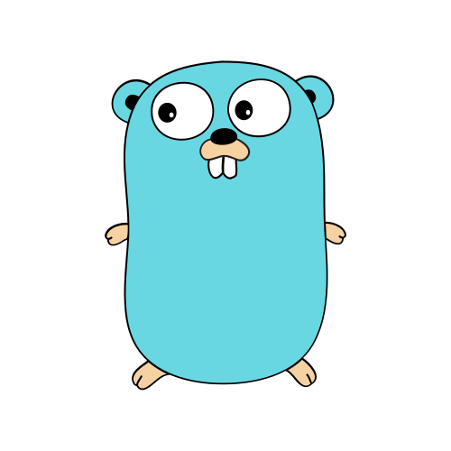

<h1 align="center">
  <a href="https://whoisarepo.fyi" label="fyi">WHOISAREPO❓</a>
</h1>

<blockquote align="center">
    
<i>Programmer (n.) - One who forges programmes.</i>

</blockquote>

<blockquote align="right">
<i>I am who I am  
& who I am is what I am 
& who I am is where I am 
& who I am is when I am 
& who I am is why I am. 
</i></blockquote>

<h3 align="left"><i>
  <a href="https://desirtechnologies.pro">forge</a>
  <a href="https://desirfoundation.space">a</a>
  <a href="https://arepo.space">better</a> 
  <a href="https://logos.computer">phaneron.</a>
</i></h3>

<h1 align="center">LATEST ACTIVITIES</h1>
<table align="center">
  <tr>
    <th>NAME</th>
    <th>KIND</th>
    <th>TL;DR</th>
    <th>LINK</th>
    <th>MACH</th>
  </tr>
  <tr id="updoc">
    <td>
      
UPDOC

    </td>
    <td>
      
CLI

    </td>
    <td>
      
README Generator

    </td>
    <td>
      
<a href="https://github.com/desirtechnologies/updoc">@updoc</a>

    </td>
    <td>
      
<code>0.0.1@8.28.25</code>

    </td>
  </tr>
<tr id="voorman-problems">
    <td>
        
VOORMAN

    </td>
    <td>
        
EDU

    </td>
    <td>
        
Educational website for solving programming problems.

    </td>
    <td>
        
<a href="https://github.com/desirtechnologies/voorman.problems">@voormanproblems</a>

    </td>
    <td>
        
<code>0.0.1@8.28.25</code>

    </td>
</tr>
<tr id="arepodesir">
    <td>
        
AREPO DESIR

    </td>
    <td>
        
UPDOC

    </td>
    <td>
        
UPDOC

    </td>
    <td>
        
<a href="https://github.com/desirtechnologies/arepodesir">@arepodesir</a>

    </td>
    <td>
        
<code>1.001</code>

    </td>
</tr>
<tr id="blackprint">
    <td>
        
BLACKPRINT

    </td>
    <td>
        
UPDOC

    </td>
    <td>
        
UPDOC

    </td>
    <td>
        
<a href="https://github.com/desirtechnologies/blackprint">@blackprint</a>

    </td>
    <td>
        
<code>0.0.1@8.28.25</code>

    </td>
</tr>

</table>

<table align="left">
<tr title="socials">
<h1 align="left">SOCIALS </h1>
    <th></th>
    <th></th>
    <th></th>
    <th></th>
    <th></th>
    <th></th>
</tr>
</table>

<table align="right">
<tr title="languages">
<h1 align="right">LANGUAGES </h1>
    <th></th>
    <th></th>
    <th></th>
    <th></th>
    <th></th>
    <th></th>
</tr>
</table>

<table align="left">
<tr title="skills">
<h1 align="left">SKILLS </h1>
    <th></th>
    <th></th>
    <th></th>
    <th></th>
    <th></th>
    <th></th>
</tr>
</table>

<table align="right">
<tr title="links">
<h1 align="right">LINKS </h1>
    <th></th>
    <th></th>
    <th></th>
    <th></th>
    <th></th>
    <th></th>
</tr>
</table>

<table align="left">
<tr>
<th align="center"><blockquote>"Strive not to be a success, but rather to be of value." - Albert Einstein</blockquote></th>
</tr>

<tr align="center">
<th align="center">Made with &nbsp; <3 &nbsp; by Arepo Desir | <code> &copy; 2025 Arepo Desir</code> | <code>MACH 1.002</code></th>
</tr>

<tr align="center">
<th align="center"><i>Last Updated:</i> <code>2025-09-08T19:37:14-04:00</code></th>
</tr>

</table>