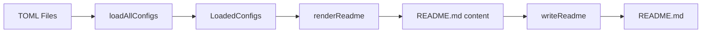

# AREPODESIR README Generator - Technical Architecture

A functional, Effect-TS powered README generator that compiles TOML configurations into a beautifully formatted GitHub profile README.

---

## System Overview

```
┌─────────────────────────────────────────────────────────────────────────┐
│                          main/main.ts                                    │
│                     (Entry Point & Runner)                               │
└──────────────────────────────┬──────────────────────────────────────────┘
                               │
                               ▼
┌─────────────────────────────────────────────────────────────────────────┐
│                         main/prelude.ts                                  │
│                   (Effect Pipeline Orchestration)                        │
│   ┌──────────────┐   ┌──────────────┐   ┌──────────────────────────┐    │
│   │ loadAllConfigs│ → │ renderReadme │ → │ writeReadme              │    │
│   └──────────────┘   └──────────────┘   └──────────────────────────┘    │
└─────────────────────────────────────────────────────────────────────────┘
                    │                │                    │
          ┌────────┴────────┐       │             ┌─────┴──────┐
          ▼                 ▼       ▼             ▼            ▼
    ┌──────────┐     ┌──────────┐ ┌──────────┐ ┌──────────┐ ┌────────┐
    │  configs │     │ templates│ │ services │ │   lib    │ │ types  │
    │  (TOML)  │     │(renders) │ │(I/O, TUI)│ │(helpers) │ │ (ADTs) │
    └──────────┘     └──────────┘ └──────────┘ └──────────┘ └────────┘
```

---

## Module Descriptions

### Entry Point (`main/`)

| Module | Purpose |
|:-------|:--------|
| [main.ts](file:///home/arepo/LOGOS/PRAGMATA/CODE/arepodesir/source/main/main.ts) | Async runner with Effect-to-Promise bridge |
| [prelude.ts](file:///home/arepo/LOGOS/PRAGMATA/CODE/arepodesir/source/main/prelude.ts) | Core pipeline: load → render → write |

### Library (`lib/`)

| Module | Purpose |
|:-------|:--------|
| [functionals.ts](file:///home/arepo/LOGOS/PRAGMATA/CODE/arepodesir/source/lib/functionals.ts) | Effect-TS re-exports, `compose`, `Functional` |
| [markdown.ts](file:///home/arepo/LOGOS/PRAGMATA/CODE/arepodesir/source/lib/markdown.ts) | Tagged templates: `md`, `h2`, `p`, `table` |
| [ansi.ts](file:///home/arepo/LOGOS/PRAGMATA/CODE/arepodesir/source/lib/ansi.ts) | Terminal colors, box-drawing, `styled` |
| [tui.ts](file:///home/arepo/LOGOS/PRAGMATA/CODE/arepodesir/source/lib/tui.ts) | `definePanel`, `defineProgress`, `defineStatus` |
| [cli.ts](file:///home/arepo/LOGOS/PRAGMATA/CODE/arepodesir/source/lib/cli.ts) | `defineCLI`, `defineProgram` |
| [toml.ts](file:///home/arepo/LOGOS/PRAGMATA/CODE/arepodesir/source/lib/toml.ts) | smol-toml parsing wrapper |

### Services (`services/`)

| Module | Purpose |
|:-------|:--------|
| [Terminal.ts](file:///home/arepo/LOGOS/PRAGMATA/CODE/arepodesir/source/services/Terminal.ts) | TUI-enhanced console output |
| [Writer.ts](file:///home/arepo/LOGOS/PRAGMATA/CODE/arepodesir/source/services/Writer.ts) | Effect-based file I/O via Bun |
| [Readme.ts](file:///home/arepo/LOGOS/PRAGMATA/CODE/arepodesir/source/services/Readme.ts) | High-level render service |

### Templates (`templates/`)

| Module | Renders |
|:-------|:--------|
| [index.ts](file:///home/arepo/LOGOS/PRAGMATA/CODE/arepodesir/source/templates/index.ts) | `renderReadme()`, all section renderers |
| [social-status.ts](file:///home/arepo/LOGOS/PRAGMATA/CODE/arepodesir/source/templates/social-status.ts) | Mood, activity, GitHub stats |
| [badges.ts](file:///home/arepo/LOGOS/PRAGMATA/CODE/arepodesir/source/templates/badges.ts) | Tech stack & profile badges |

### Configuration (`configs/`)

| File | Schema |
|:-----|:-------|
| `banner.conf.toml` | `BannerConfig` |
| `header.conf.toml` | `HeaderConfig` |
| `footer.conf.toml` | `FooterConfig` |
| `skills.conf.toml` | `SkillsConfig` |
| `activities.conf.toml` | `ActivityConfig[]` |
| `social-status.conf.toml` | `SocialStatusConfig` (optional) |
| `badges.conf.toml` | `BadgesConfig` (optional) |

---

## Core Patterns

### 1. Effect Pipeline
```typescript
pipe(
  Effect.tap(Effect.void, () => Terminal.logStep("...")),
  Effect.flatMap(() => loadAllConfigs(CONFIG_DIR)),
  Effect.map((configs) => ({ content: renderReadme(configs) })),
  Effect.flatMap(({ content }) => writeReadme(PROJECT_ROOT, content)),
)
```

### 2. Tagged Error Types
```typescript
export class ConfigNotFoundError {
    readonly _tag = "ConfigNotFoundError";
    constructor(readonly path: string) {}
}
```

### 3. Optional Config Loading
```typescript
export const loadOptionalConfig = <T>(path: string) =>
  pipe(
    loadConfig<T>(path),
    Effect.map(Option.some),
    Effect.catchTag("ConfigNotFoundError", () => Effect.succeed(Option.none()))
  );
```

### 4. define\<Name\> Factory Pattern
```typescript
export function defineTemplate<T extends unknown[]>(
  closure: (...args: T) => string[]
): T extends [] ? string : (...args: T) => string
```

---

## Data Flow



---

## D2 Diagram

See [ARCHITECTURE.d2](file:///home/arepo/LOGOS/PRAGMATA/CODE/arepodesir/docs/ARCHITECTURE.d2) for the visual architecture diagram.

Render with:
```bash
d2 docs/ARCHITECTURE.d2 docs/architecture.svg
```

---

## Tech Stack

| Technology | Purpose |
|:-----------|:--------|
| **Bun** | Runtime & bundler |
| **TypeScript** | Type-safe development |
| **Effect-TS** | Functional composition, error handling |
| **smol-toml** | TOML parsing |

---

## Build & Run

```bash
# Generate README
bun run main

# Build binary
bun run build

# Type check
npx tsc --noEmit
```
